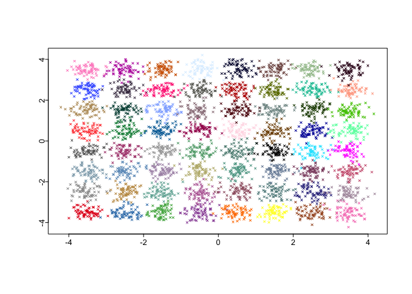
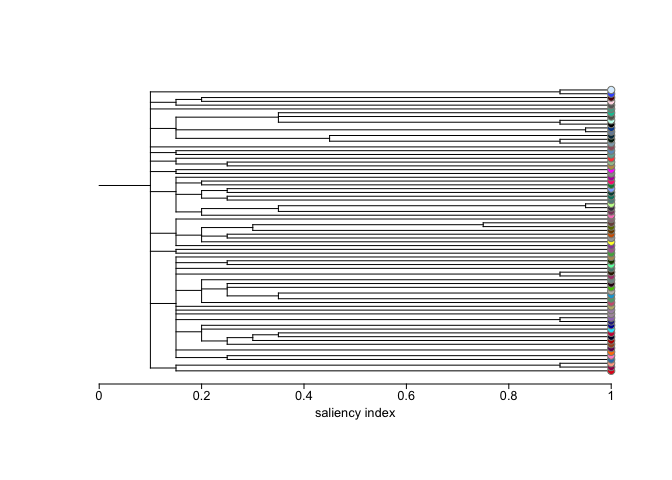
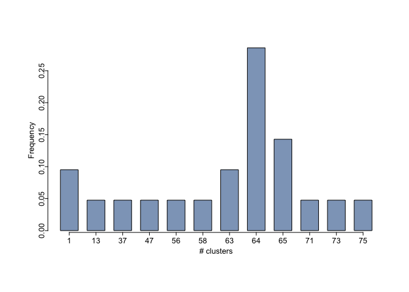
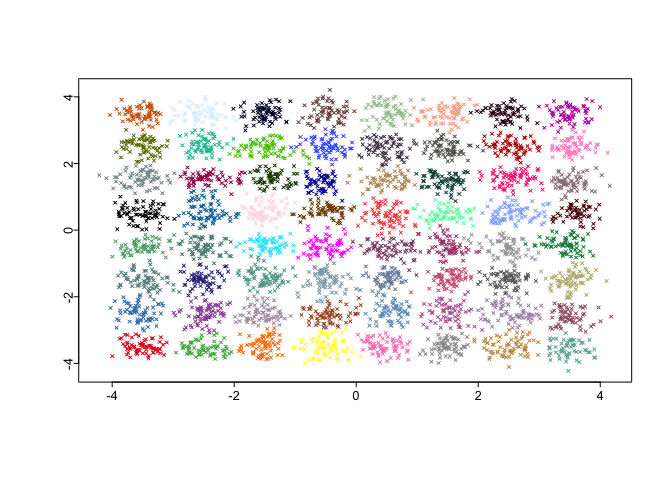
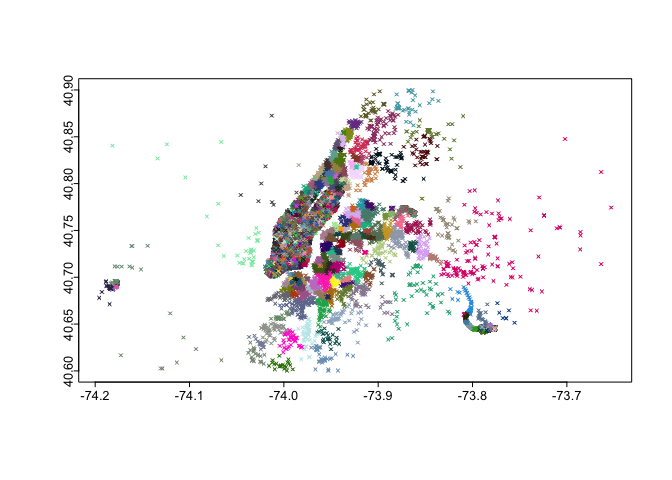
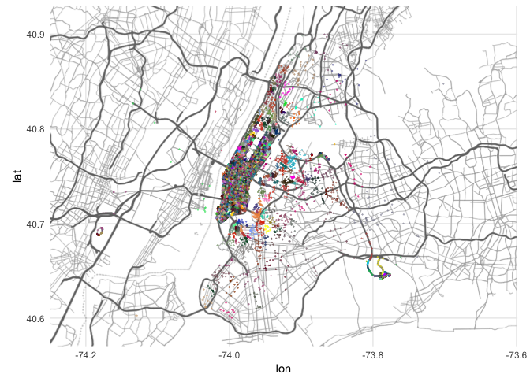

Testing the DensityCut Algorithm on Taxi Data
================

Clustering can be very useful when analyzing noisy real world data. NYC Taxi data is a perfect candidate for this. However, many clustering algorithms, such as hdbscan, have been failing to work on datasets larger than ~100K rows of data. When they do work, they are slow.

[densityCut](https://www.ncbi.nlm.nih.gov/pubmed/27153661) is a new algorithm proposed by Ding, Shah and Condon, "a novel density-based clustering algorithm, which is both time- and space-efficient".

A copy of their 2016 paper can be found [here](https://www.ncbi.nlm.nih.gov/pubmed/27153661) and the 37 MB zip file for installation can be found [here](https://bitbucket.org/jerry00/densitycut_dev)

Note that you can successfully install the denistycut package from the above link if you first download the zip folder then delete away the `data` sub-folder. It's quite large and unnecessary for installation.

``` r
library(densitycut)
library(mvtnorm)
library(sf)
library(tidyverse)

# load color pallette (this comes in the 'data' folder, so don't delet it):
load("densitycut_dev/data/distinct.col.rda")
```

Inital example
==============

``` r
set.seed(0)
N = 2^12
number.cluster = 64
N = N / number.cluster

i  = j = seq(-3.5, 3.5, by=1)
mu = expand.grid(i, j)
mu = as.matrix(mu)

sigma = matrix(c(1, 0, 0, 1)*0.05, byrow=TRUE, nrow=2)

x = lapply(seq(number.cluster), function(z) rmvnorm(N, mu[z,], sigma))
x = do.call(rbind, x)

label = lapply(1:number.cluster, function(z) rep(z, N))
col = AssignLabelColor(distinct.col, unlist(label))
NeatPlot(x, col=col, pch=4, cex=0.5)
```



``` r
K = ceiling(log2(N * number.cluster))
a = DensityCut(X=x, K=K, alpha=0.85, nu=seq(0.0, 1.0, by=0.05),
               debug=FALSE, show.plot=TRUE,
               col=distinct.col)
```



``` r
col = AssignLabelColor(distinct.col, a$cluster)
NeatPlot(x, col=col, pch=4, cex=0.5)
```



Taxi data
=========

The following dataset was pre-processed and conveted to an sf object. It represents all trips which started from a single property in Kips Bay, Manhattan in Q1 of 2016. Each row represents the lat/lon of a drop-off point.

``` r
clust_original <- st_read("data/taxi_rides_q1_2016.geojson")
```

    ## Reading layer `OGRGeoJSON' from data source `/Users/timkiely/Dropbox (hodgeswardelliott)/hodgeswardelliott Team Folder/Teams/Data/Tim_Kiely/densityCut-taxi-example/data/taxi_rides_q1_2016.geojson' using driver `GeoJSON'
    ## converted into: POINT
    ## Simple feature collection with 249398 features and 3 fields
    ## geometry type:  POINT
    ## dimension:      XY
    ## bbox:           xmin: -74.63605 ymin: 40.3768 xmax: -73.16642 ymax: 41.15786
    ## epsg (SRID):    4326
    ## proj4string:    +proj=longlat +datum=WGS84 +no_defs

``` r
# filter with a bouding box to simplify the final output 
clust_original <- 
  bind_cols(clust_original,
            as_data_frame(clust_original %>% st_coordinates()) %>% rename("lon"=X,"lat"=Y)
            ) %>% 
  filter(lat > 40.6, lat < 40.9, lon > -74.25, lon < (-1*73.55))


# matrix of lat/lon points
clust_matrix <-
  clust_original %>% 
  st_coordinates()

# parameters for DensityClust
N = nrow(clust_matrix)
number.cluster = 30
N = N / number.cluster

K <- ceiling(log2(N * number.cluster))
x <- clust_matrix

start_time <- Sys.time()
a <- DensityCut(X=x, K=K
                , alpha=0.85
                , nu=seq(0.0, 1.0, by=0.05)
                ,debug=FALSE
                , show.plot=F
                , col = distinct.col)
end_time <- Sys.time()

# assign colors:
col = AssignLabelColor(distinct.col, a$cluster)
NeatPlot(x, col=col, pch=4, cex=0.5)
```



``` r
message("Clustering Time: ",round((end_time-start_time)/60,2)," minutes")
```

    ## Clustering Time: 0.65 minutes

We can make the map more visually appealing:

``` r
clust_original$cluster <- a$cluster

library(ggmap)
sbbox <- make_bbox(lon = clust_original$lon, lat = clust_original$lat, f = .1)
suppressMessages({
  sq_map <- get_map(location = sbbox, maptype="terrain-lines", source = "stamen",color = "bw")
})

ggmap(ggmap = sq_map)+
  geom_point(data = clust_original %>% head(n=100000), aes(color = as.character(cluster)), size = 0.1, alpha = 0.5)+
  scale_color_manual(values = col)+
  coord_map()+
  theme_minimal()+
  theme(legend.position = "none")
```


